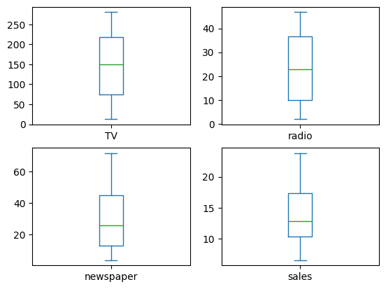

# Linear Regression on Advertising Dataset

This project uses a linear regression model to predict sales based on advertising spend on **TV**, **Radio**, and **Newspaper**. The dataset consists of investment amounts (in thousands of dollars) and corresponding sales results. The goal is to understand how marketing investments influence sales and to build a predictive model for future sales forecasting.

---

## Project Overview

The objective of this project is to explore the relationship between advertising budgets and sales and build a predictive model using **Linear Regression**. We performed data analysis, removed outliers, trained a regression model, and evaluated its performance.

---

## Steps in the Project

### 1. **Data Exploration**
- Checked for missing values, data types, and basic statistics.
- Visualized the data using **boxplots** and **scatter plots** for better understanding.

### 2. **Outlier Removal**
- Applied a **clipping method** to handle outliers and improve model performance.
- Below are boxplots showing the dataset before and after outlier removal.

**Boxplot Before Outlier Removal**  

**Boxplot After Outlier Removal**  

### 3. **Custom Train-Validation-Test Split**
- Implemented a manual function to split the dataset into training, validation, and test sets in a **70-15-15 ratio** for better evaluation.

### 4. **Model Training**
- Trained a linear regression model using `LinearRegression` from `scikit-learn`.
- Evaluated the model using **Mean Squared Error (MSE)** and **R² Score**.

### 5. **Model Evaluation**
The model's performance is summarized below:
- **Validation MSE**: 2.5  
- **Validation R²**: 0.87  
- **Test MSE**: 2.8  
- **Test R²**: 0.85  

**Actual vs Predicted Sales Plot**  
This plot shows how well the predicted sales match the actual sales.

### 6. **Model Saving**
- The trained model is saved using `joblib` for future use.

---

## Model Description

### What is Linear Regression?

Linear Regression is a statistical method used to model the relationship between a dependent variable (target) and one or more independent variables (features). The model assumes a **linear relationship** between the target and the features.

The mathematical representation for **Simple Linear Regression** (with one feature) is:

For **Multiple Linear Regression** (with multiple features), the equation becomes:

Where:
- **y**: Target variable (sales)
- **x₁, x₂, ..., xn**: Independent variables (TV, Radio, Newspaper advertising budgets)
- **β₀**: Intercept (baseline sales when all advertising spends are zero)
- **β₁, β₂, ..., βn**: Coefficients representing the change in sales for a unit change in each advertising budget
- **ε**: Error term (difference between actual and predicted sales)

### How the Model Works
1. **Model Fitting**: The model finds the best coefficients (\( \beta \)) by minimizing the **Residual Sum of Squares (RSS)** — the difference between actual and predicted sales.  
2. **Prediction**: Once trained, the model uses the learned coefficients to predict sales based on new advertising budgets.  
3. **Evaluation**: Metrics like **Mean Squared Error (MSE)** and **R² Score** help assess how well the model generalizes to new data.

### Why Linear Regression?
- Simple to implement and interpret.  
- Provides insight into how each feature impacts the target.  
- Computationally efficient and ideal for small to medium-sized datasets.

---

